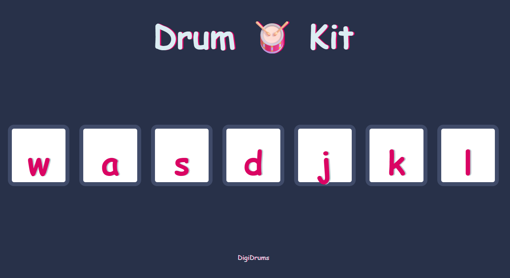

# 🥁 digiDrums

**digiDrums** is a simple web-based drum kit that lets users play drum sounds using their keyboard or by clicking on on-screen buttons.

This project was built as part of the [The Complete 2024 Web Development Bootcamp](https://www.udemy.com/course/the-complete-web-development-bootcamp/) by **Dr. Angela Yu** on Udemy.

## 🌟 Features

- Play 7 different drum sounds using either mouse clicks or keyboard keys (`w`, `a`, `s`, `d`, `j`, `k`, `l`)
- Visual button press animation
- Responsive layout — works on desktop and mobile
- Simple, minimal UI using HTML, CSS, and JavaScript

## 💻 Technologies Used

- HTML5
- CSS3
- JavaScript (ES6)
- GitHub Pages for hosting

---
# 🥁 digiDrums

**Live demo →** [digiDrums](https://rakmo5.github.io/digiDrums/)

## 🎨 Preview

---

## 🎮 How to Use

- Visit the live site: [digiDrums](https://rakmo5.github.io/digiDrums/)
- Press any of these keys on your keyboard: `w`, `a`, `s`, `d`, `j`, `k`, `l`
- Or tap the corresponding buttons on the screen

## 📱 Mobile Support

The interface is optimized for smaller screens using media queries. Tap the buttons directly to play sounds.

## 📁 Folder Structure

digiDrums/
├── index.html
├── styles.css
├── script.js
├── sounds/
│ ├── tom-1.mp3
│ ├── tom-2.mp3
│ ├── ...
└── images/
├── tom1.png
├── tom2.png
├── ...

---

## 🙏 Credits

- Project inspired by [Angela Yu's Web Development Bootcamp](https://www.udemy.com/course/the-complete-web-development-bootcamp/)
- Sound files and images provided as part of the course resources

---

## 🪄 License

This project is for learning purposes only.  
All rights for course content belong to Dr. Angela Yu and The App Brewery.

---

